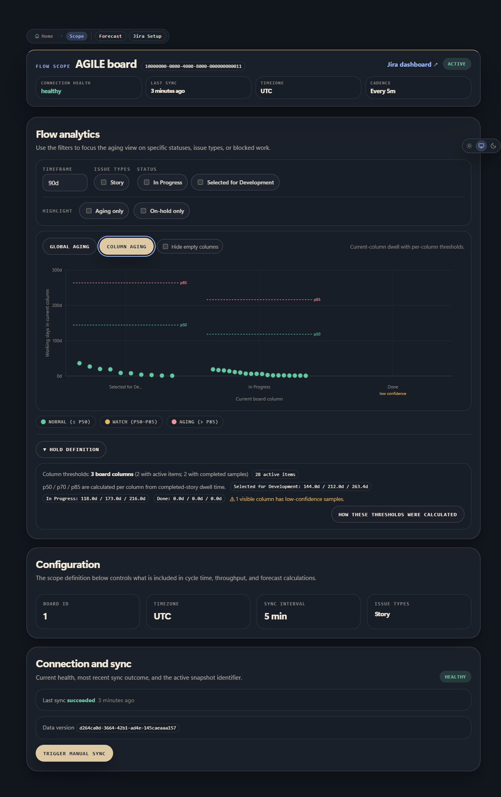
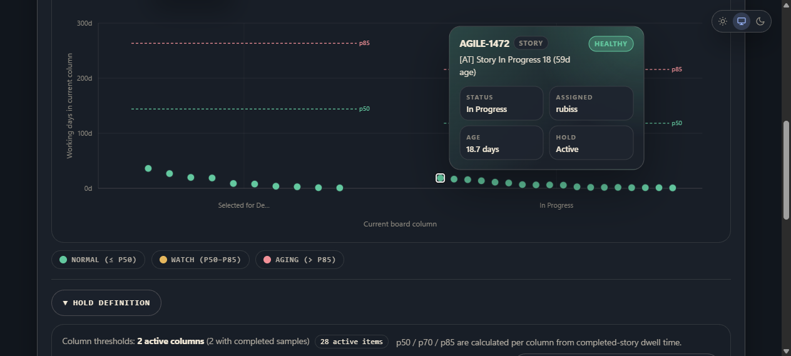
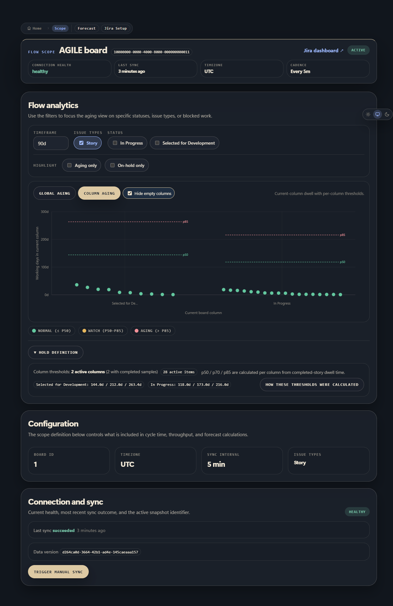

## Summary

- restore a real hover popup for the column aging chart
- limit column aging to the configured in-scope board span
- make hidden-column mode reclaim horizontal space and spread dense Jira dots apart
- reduce y-axis label density for wide day ranges
- address the Copilot review comments on column scoping and column ordering
- add screenshot evidence under `docs/evidence/column-aging/`

## Verification

- `pnpm vitest run apps/web/src/app/api/v1/scopes/[scopeId]/flow/column-aging-scope.test.ts apps/web/src/server/views/flow-analytics.test.ts apps/web/src/components/flow/column-aging-scatter-plot.test.tsx apps/web/src/components/flow/flow-analytics-section.test.tsx apps/web/src/components/flow/aging-scatter-plot.test.tsx`
- `pnpm lint`
- `pnpm typecheck`
- `pnpm test`
- `pnpm --filter @agile-tools/web build`
- `docker compose -p agile-tools-verify -f docker-compose.yml build web worker`
- `docker compose -p agile-tools-verify -f docker-compose.yml up -d web worker`

## Evidence

All screenshots below are from the real app running in local Docker.

Only in-scope columns are shown in the live column-aging chart: `Selected for Development`, `In Progress`, `Done`. The `Done` column remains visible with its low-confidence label and zero dwell points, while out-of-scope board columns do not appear.

Hover popup is working on a real Jira dot and shows the work item details.

When empty columns are hidden, the remaining columns expand across the available width instead of collapsing to the outer edges. The same screenshot also shows the reduced y-axis labeling for a wide range (`0d`, `100d`, `200d`, `300d`).

Dense-cluster proof from the live chart:

- `28 active items` are shown in the chart summary
- the `In Progress` column renders a dense right-side cluster with `16` visible dots in the same area
- the hide-empty screenshot shows those dots spread across the full in-progress band instead of piling on a narrow centerline
