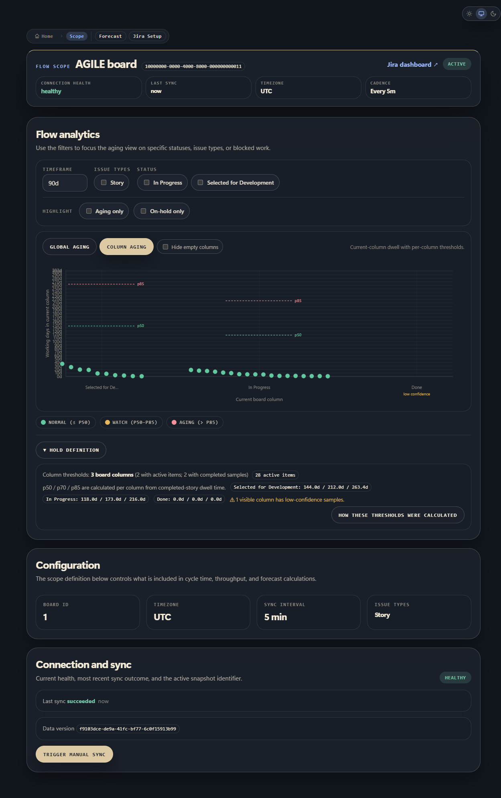
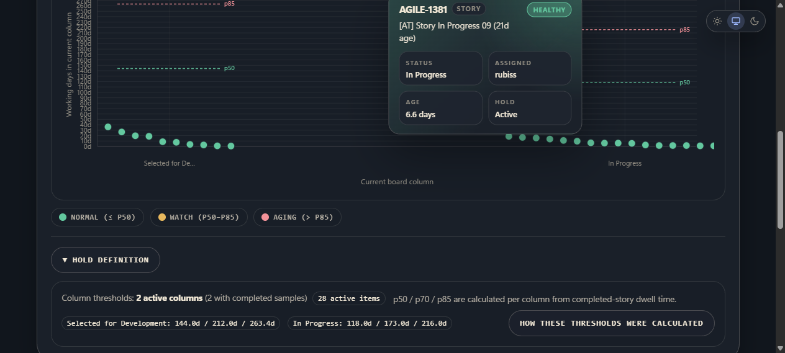
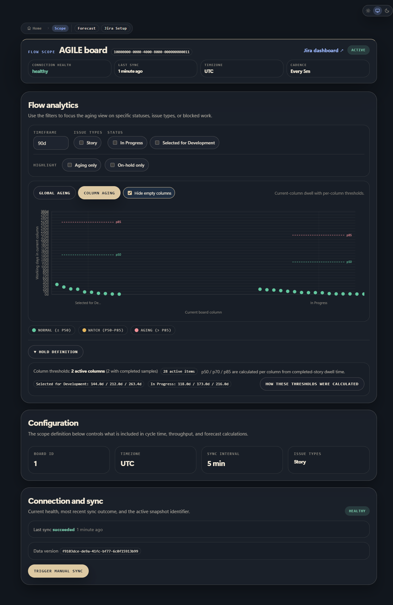

## Summary

- restore a real hover popup for the column aging chart
- limit column aging to the configured in-scope board span
- make hidden-column mode reclaim horizontal space and spread dense Jira dots apart
- add screenshot evidence under `docs/evidence/column-aging/`

## Verification

- `pnpm vitest run apps/web/src/app/api/v1/scopes/[scopeId]/flow/column-aging-scope.test.ts apps/web/src/components/flow/column-aging-scatter-plot.test.tsx apps/web/src/components/flow/flow-analytics-section.test.tsx apps/web/src/components/flow/aging-scatter-plot.test.tsx`

## Evidence

All screenshots below are from the real app running in local Docker after syncing the local Jira dataset.

Only in-scope columns are shown in the live column-aging chart: `Selected for Development`, `In Progress`, `Done`.

Hover popup is working on a real Jira dot and shows the work item details.

When empty columns are hidden, the remaining columns expand across the available width.

Dense-cluster proof from the live chart:

- `28 active items` are shown in the chart summary
- the `In Progress` column renders a dense right-side cluster with `16` visible dots in the same area
